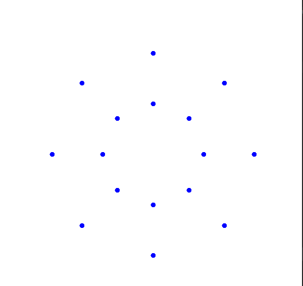

# What is this repository about?
This repository is my implementation (perhaps not very accurate but anyways) of delaunay triangulation algorithm for 2d.
 
 
### Note
I'm not a professional java programmer and I'm not exactly a specialist in this stuff so there could be mistakes and inaccuracies basically anywhere, so be careful while using this repository.

# Task
The goal is to implement an algorithm for triangulating a 2 dimensional domain using the Delaunay method.
 
#### Initial data
An area in the form of a curvilinear ring bounded by two closed flat polygons, each of which is defined by a sequence of segments.
  
*Note: task was translated using google translate*
# Algorithm
1. Generate array of points representing object described in [**Initial data**](#initial-data).
 

    

2. Sort all points generated on  first step in one direction (in the direction of the x-axis).
3. Take first 3 points. Check that there are no points inside the circle built on three points. If there are no points inside circle, then we can generate tree edges.
4. If this is not first iteration, then we can check if generated so far edges are "good".
    * Let's take first 5 edges. Now basically we have quadrilateral (let's call it ABCD) with a diagonal (for example, DB).
    * Calculate every angle inside quadrilateral ABCD with diagonal DB (6 angles) and find the minimum angle.
    * Now lets change diagonal inside ABCD (was DB and now diagonal is AC).
    * Find minimum angle inside quadrilateral ABCD with diagonal AC.
    * If minimum angle of quadrilateral with changed diagonal if greater than minimum angle of initial quadrilateral, we would change diagonal DB to AC.
    * Repeat for every generated edge.
5. Repeat steps 3 and 4 for all points.
6. Now we are left with multiple edges that are "good". Each edge consists of two connected points. Well, now we need to plot all this stuff by connecting every point in right manner (to have at the end only "good" edges). So we need to create a path from first point to last one.
7. That's it, now we can easily plot the resulting triangulation.